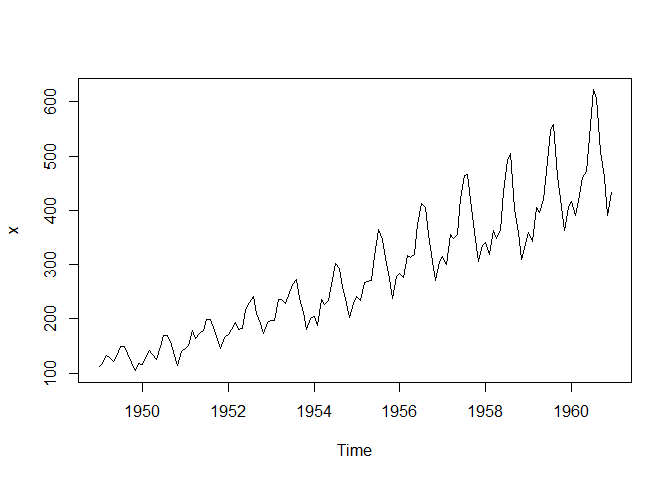
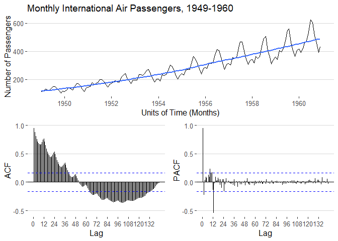
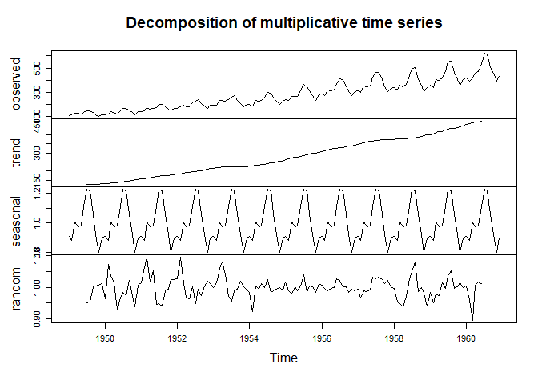
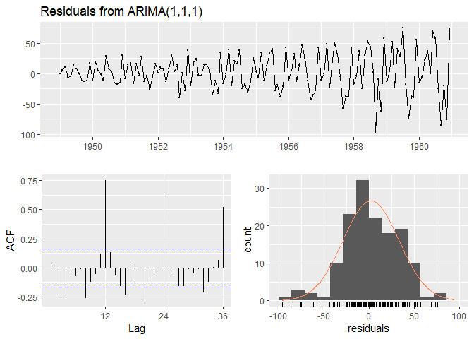
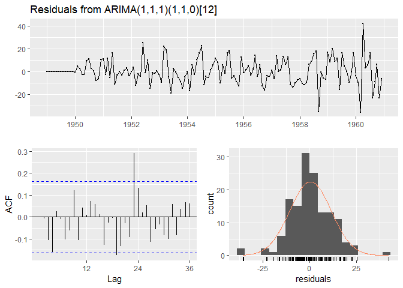
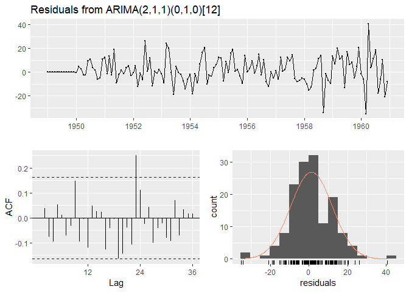

Univariate Time Series Modeling in R
================
Jordan M. Foley
May 20, 2019

This document is a brief tutorial detailing how to get started doing univariate time series analysis in R. You may want to have the [associated slides](https://github.com/jlukito/timeseries-bootcamp/blob/master/2_univariate/slidedeck_univariate.pdf) open while reading and/or working through this document.

Even though the math and concepts behind these temporal processes seems daunting, there is a wide universe of flexible time series packages and functions in `R` that make most of this a breeze. In addition to base `R` code for handling time series data, we'll be primarily use the `forecast` created and maintained by Rob Hyndman. He writes a lot of helpful time series packages and also put together a detailed, frequently updated [time series page](https://cran.r-project.org/web/views/TimeSeries.html) that you should bookmark immediately. We will also use functions from the `tseries` and `vrtest` and `arfima` packages.

``` r
library(forecast)
library(tseries)
library(vrtest)

x <- AirPassengers
```

We'll be using the built-in Airpassengers dataset, which is a classic toy time series the monthly totals of international airline passengers from 1949 to 1960.

Note that this dataset is a `ts` object, a special base `R` class for handling time series data. Check out the [data wrangling](https://github.com/jlukito/timeseries-bootcamp/tree/master/1_wrangling) section for details on other time series formats in R.

Exploration, Inspection, and Decomposition
==========================================

The first step should always be to inspect the plot of the univariate time series you are interested in modeling.

``` r
plot(x)
```



While this is nice for quick plotting, I prefer using `ggtsdisplay()` from the `forecast` package, which plots the raw series alongside the ACF and PACF plots of the time series with a few useful internal knobs and whistles. You can also add `ggplot` layers to this figure outside of the `ggtsdisplay` function.

``` r
ggtsdisplay(x, plot.type = "partial", points = FALSE, lag.max = 250, smooth = TRUE,
            main = "Monthly International Air Passengers, 1949-1960",
            xlab = "Units of Time (Months)",
            ylab = "Number of Passengers",
            theme = ggthemes::theme_hc())
```



Another useful exploratory plot to visually expect is the *decomposition* plot that plots the raw series, the trend line (same as blue line in above plot), a plot of the seasonal component of the series, if one exists, and a random/remainder component.

There are two decomposition functions in the `stats` package: `decompose()` and `stl`.

``` r
x %>%
  decompose("multiplicative") %>%
  plot()
```



``` r
x %>%
  stl(s.window = 12) %>% # seasonal window - 12 months
  plot()
```


`stl()` has more sophisticated set of parameters than `decompose()`, but both can broadly accomplish the same task.

Armed with this information, we can now make a series of informed guesses about what our initial ARIMA(*p*,*d*,*q*) model that is most appropriate. The secondary peaks in the ACF are evidence of a seasonal component, which we confirmed in the decomposed series.

Referring back to the archetypes of ACF/PACF functions (slides 12 + 13), the pattern in the `Airpassengers` dataset seems to closely resemble the ARMA(1,1) model. If you ignore the upticks in the ACF due to the seasonal component, the autocorrelation descends consistently over time. In addition, the PACF plot has significant autocorrelations in opposite directions, followed by oscillating, mostly insignificant correlations until we hit 12 months out, which is, agian, the seasonal component.

Stationarity and Unit Root Tests
================================

Next, we will want to deal with the fact that the time series appears to violate the requirement that the data is stationary. That is, the number of international air travel passengers increases over time without returning back to a stable equilibrium, even though the patterns in the data themselves are consistent.

Remember that if we have a non-stationary time series, we need to transform it into a stationary series in order for our models to work properly.

Even if you have strong visual evidence of a unit root, its always best practices to both run and report the results of several unit root tests.

First, we run the augmented Dickey-Fuller test:

``` r
adf.test(x)
```

    ## Warning in adf.test(x): p-value smaller than printed p-value

    ## 
    ##  Augmented Dickey-Fuller Test
    ## 
    ## data:  x
    ## Dickey-Fuller = -7.3186, Lag order = 5, p-value = 0.01
    ## alternative hypothesis: stationary

The null hypothesis is that the series is non-stationary and we have a p-value that is low enough to reject the null,

The KPSS test, on the other hand, has a null hypothesis that the series is stationary.

``` r
kpss.test(x)
```

    ## Warning in kpss.test(x): p-value smaller than printed p-value

    ## 
    ##  KPSS Test for Level Stationarity
    ## 
    ## data:  x
    ## KPSS Level = 2.7395, Truncation lag parameter = 4, p-value = 0.01

As you can see, we are getting conflicting results from our first two unit root tests. The ADF test says the series is stationary while the KPSS test rejects its null hypothesis, indicating that the series is non-stationary.

So what do we do?

Your first instict should be to use a few more tests just to be sure. Here we will run the variance ratio test mentioned in the slides.

``` r
Auto.VR(x)
```

    ## $stat
    ## [1] 27.36955
    ## 
    ## $sum
    ## [1] 121.568

Again, we get additional evidence that our series is stationary, since the test statistic deviates from 1.

Building and Testing an ARIMA Model
===================================

So we have two tests that provide us evidence of stationarity, and one test that shows us evidence of non-stationarity.

Based on the patterns we see in the ACF and PACF plots, the decompositoin plots, and the unit root tests, it would be reasonable to initially guess that this series was an ARMA(1,1) process or an ARIMA(1,1,1) process. the `forecast` package gives us several easy to use functions to build and test each of these models.

``` r
x %>%
  Arima(order = c(1, 1, 1),
        seasonal = list(order = c(0, 0, 0), period = 12, lamda = 0))
```

    ## Series: . 
    ## ARIMA(1,1,1) 
    ## 
    ## Coefficients:
    ##           ar1     ma1
    ##       -0.4741  0.8634
    ## s.e.   0.1159  0.0720
    ## 
    ## sigma^2 estimated as 975.8:  log likelihood=-694.34
    ## AIC=1394.68   AICc=1394.86   BIC=1403.57

``` r
x %>%
  Arima(order = c(1, 0, 1),
        seasonal = list(order = c(0, 0, 0), period = 12, lamda = 0))
```

    ## Series: . 
    ## ARIMA(1,0,1) with non-zero mean 
    ## 
    ## Coefficients:
    ##          ar1     ma1      mean
    ##       0.9373  0.4264  281.5426
    ## s.e.  0.0302  0.0911   53.6135
    ## 
    ## sigma^2 estimated as 989.1:  log likelihood=-700.87
    ## AIC=1409.75   AICc=1410.04   BIC=1421.63

Here we have created an ARIMA model with and without differencing the series since we have gotten conflicting unit root test results. Based on the AIC and BIC diagnostics for each of the models, an ARIMA model with a unit root actually models the data better.

Now, we should take the residuals from best fitting model and plot the ACF again to see if we have any leftover serial correlation to explain.

``` r
air_arima <- x %>%
  Arima(order = c(1, 1, 1),
        seasonal = list(order = c(0, 0, 0), period = 12, lamda = 0))

checkresiduals(air_arima)
```



    ## 
    ##  Ljung-Box test
    ## 
    ## data:  Residuals from ARIMA(1,1,1)
    ## Q* = 231.49, df = 22, p-value < 2.2e-16
    ## 
    ## Model df: 2.   Total lags used: 24

Based on the the ACF, it looks like we have some leftover seasonality to model out of the data. Notice in the initial ARIMA model we provided the number of periods, but did not specify an order of seasonality. Seasonal components may have their own ARIMA(*p*,*d*,*q*) process, though they tend to be less complicated than the full ARIMA. Since this seasonality peaks once each 12 months and slowly declines, it looks like it includes an AR(1) process.

Lets run that model, inspect the diagnostic statistics, and then check the residual again.

``` r
x %>%
  Arima(order = c(1, 1, 1),
        seasonal = list(order = c(1, 1, 0), period = 12, lamda = 0))
```

    ## Series: . 
    ## ARIMA(1,1,1)(1,1,0)[12] 
    ## 
    ## Coefficients:
    ##           ar1      ma1     sar1
    ##       -0.2155  -0.0881  -0.1418
    ## s.e.   0.4895   0.5148   0.0986
    ## 
    ## sigma^2 estimated as 137.8:  log likelihood=-507.18
    ## AIC=1022.36   AICc=1022.67   BIC=1033.86

``` r
air_arima2 <- x %>%
  Arima(order = c(1, 1, 1),
        seasonal = list(order = c(1, 1, 0), period = 12, lamda = 0))

checkresiduals(air_arima2)
```



    ## 
    ##  Ljung-Box test
    ## 
    ## data:  Residuals from ARIMA(1,1,1)(1,1,0)[12]
    ## Q* = 44.261, df = 21, p-value = 0.002163
    ## 
    ## Model df: 3.   Total lags used: 24

While these residuals look better, and the model diagnostics are much improved from our original ARIMA model, there is still something going on in the ACF and the plot of the residuals.

Here, we would evaluate, diagnose, and continue to tweak the model specification until we reached a satisfactory model. Thankfully, `forcast` has a very handy `auto.arima` function that will do much of this legwork for you.

``` r
x %>%
  auto.arima(trace = TRUE)
```

    ## 
    ##  ARIMA(2,1,2)(1,1,1)[12]                    : Inf
    ##  ARIMA(0,1,0)(0,1,0)[12]                    : 1031.539
    ##  ARIMA(1,1,0)(1,1,0)[12]                    : 1020.582
    ##  ARIMA(0,1,1)(0,1,1)[12]                    : 1021.192
    ##  ARIMA(1,1,0)(0,1,0)[12]                    : 1020.488
    ##  ARIMA(1,1,0)(0,1,1)[12]                    : 1021.103
    ##  ARIMA(1,1,0)(1,1,1)[12]                    : Inf
    ##  ARIMA(2,1,0)(0,1,0)[12]                    : 1022.583
    ##  ARIMA(1,1,1)(0,1,0)[12]                    : 1022.583
    ##  ARIMA(2,1,1)(0,1,0)[12]                    : 1018.165
    ##  ARIMA(2,1,1)(1,1,0)[12]                    : 1018.395
    ##  ARIMA(2,1,1)(0,1,1)[12]                    : 1018.84
    ##  ARIMA(2,1,1)(1,1,1)[12]                    : Inf
    ##  ARIMA(3,1,1)(0,1,0)[12]                    : 1019.565
    ##  ARIMA(2,1,2)(0,1,0)[12]                    : 1019.771
    ##  ARIMA(3,1,2)(0,1,0)[12]                    : Inf
    ## 
    ##  Best model: ARIMA(2,1,1)(0,1,0)[12]

    ## Series: . 
    ## ARIMA(2,1,1)(0,1,0)[12] 
    ## 
    ## Coefficients:
    ##          ar1     ar2      ma1
    ##       0.5960  0.2143  -0.9819
    ## s.e.  0.0888  0.0880   0.0292
    ## 
    ## sigma^2 estimated as 132.3:  log likelihood=-504.92
    ## AIC=1017.85   AICc=1018.17   BIC=1029.35

if you include `trace = TRUE` in the `auto.arima()` function, it will show you all of the various iterations of the model that were run. They are all compared based on their AIC and BIC and the final model is selected on that basis by default, but you can change these criteria within the function if you prefer.

It turns out that our initial guesses were not too far off, as the best fitting models was an ARIMA(2,1,1)(0,1,0)\[12\] model. Instead of a seasonal component with an AR(1) process, we actually had an AR(2) process in the series itself. If we inspect these residuals, we can see that our problem is now largely resolved and we have a workable "pre-whitened" series that we can now us to build our models using traditional OLS procedures.

``` r
x %>%
  Arima(order = c(2, 1, 1),
        seasonal = list(order = c(0, 1, 0), period = 12, lamda = 0))
```

    ## Series: . 
    ## ARIMA(2,1,1)(0,1,0)[12] 
    ## 
    ## Coefficients:
    ##          ar1     ar2      ma1
    ##       0.5960  0.2143  -0.9819
    ## s.e.  0.0888  0.0880   0.0292
    ## 
    ## sigma^2 estimated as 132.3:  log likelihood=-504.92
    ## AIC=1017.85   AICc=1018.17   BIC=1029.35

``` r
air_arima3 <- x %>%
  Arima(order = c(2, 1, 1),
        seasonal = list(order = c(0, 1, 0), period = 12, lamda = 0))

checkresiduals(air_arima3)
```



    ## 
    ##  Ljung-Box test
    ## 
    ## data:  Residuals from ARIMA(2,1,1)(0,1,0)[12]
    ## Q* = 37.784, df = 21, p-value = 0.01366
    ## 
    ## Model df: 3.   Total lags used: 24

To take a step back, recall that we are building this ARIMA model as a filter on our original time series. Since we know that our observations are not independent from one another and are, by definition, serially correlated with each other as a function of time, the ARIMA model is our way of systematically removing the statistical components of the sereis that are autocorrelated, or simply, the parts of the series that explain themselves.

Once you have saved the final arima model as an object, you can extract the residuals, which is the variance that is unexplained by the various types of autocorrelation that we just filtered out. This error term ideally represents the true data generating process that we want to model. This way, if we had a set of independent variables associated with this time series data, we would be predicting how those IV's model the data generating process rather than the autocorrelated portions of the series.

ARFIMA models
=============

Recall the unit root tests we did before the ARIMA modeling. When you get conflicting results from various unit root tests, it is possible this is due to the fact that these tests rely on knife-edge decisions between either differencing, I(1), or not differencing, I(0), the series.

Think about the series in terms of its *memory*. If there is a shock to a social process that generates variance, how long of a memory does that shock have in the system? If a unit root is present, the series has a *permanent memory*. Shocks that enter the system persist and add to one another without dissipating over time. But what if shocks are not permanent, but rather have a *long memory*, persisting over a longer period of time before finally leaking out of the system.

In this case, the estimate of I(*d*) would not be a 0 or a 1, but somewhere between that. The process could be weakly stationary (*d* = .2) or near-integrated (*d* = .8). ARFIMA models are ARIMA models that attempt to more accurately estimate the value of *d* in the model to account for this long memory process.

However, even if you suspected a fractionally integrated process here, you should be very hesitant to use an ARFIMA model on data like the `Airpassengers` dataset given the sample size (*N* = 144), as simulation data from Keele, Linn, & Webb (2016) \[slide 20\] indicate that we would need more data to more accurately estimate the true value of *d*.

If you did suspect a long memory process in your data, I would suggest looking into the `arfima` package and the `fracdiff` package for more details.

Forecasting
===========

In many cases, you may not simply be interesting in modeling a process but also in predicting future values of a series. Unsurprisingly, the `forecast` package makes this very easy to do in a few simple commands.

``` r
x %>%
  forecast() %>%
  plot()
```


As you can see, the forecast incorporates the seasonal and trend components of the data to make point predictions based on previous values in the series. Check out the package details for the `forecast()` function to how to generate forecasts based on each of the specific models that you created in the above sections and see how different the predictions can be!
