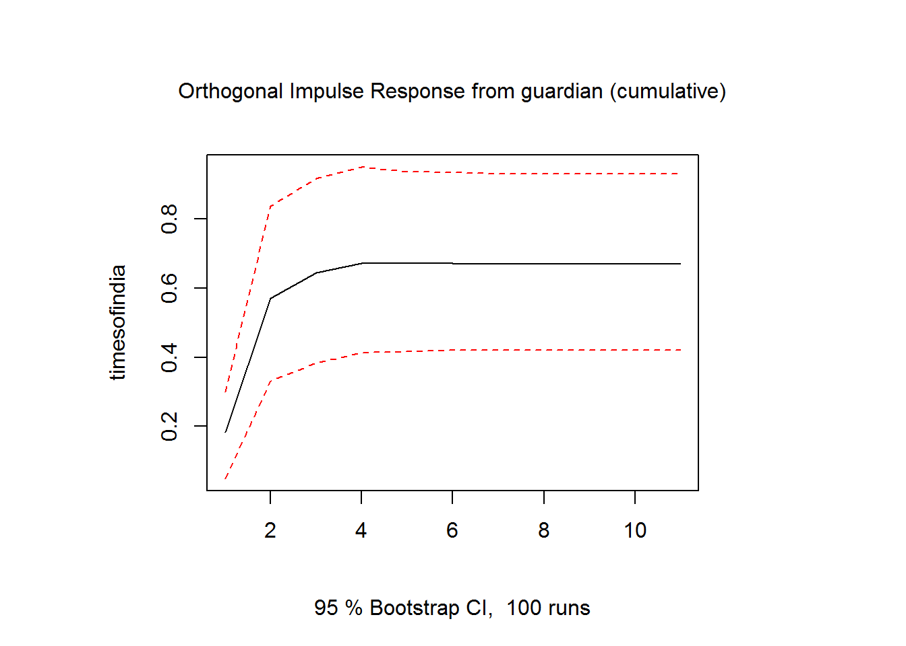
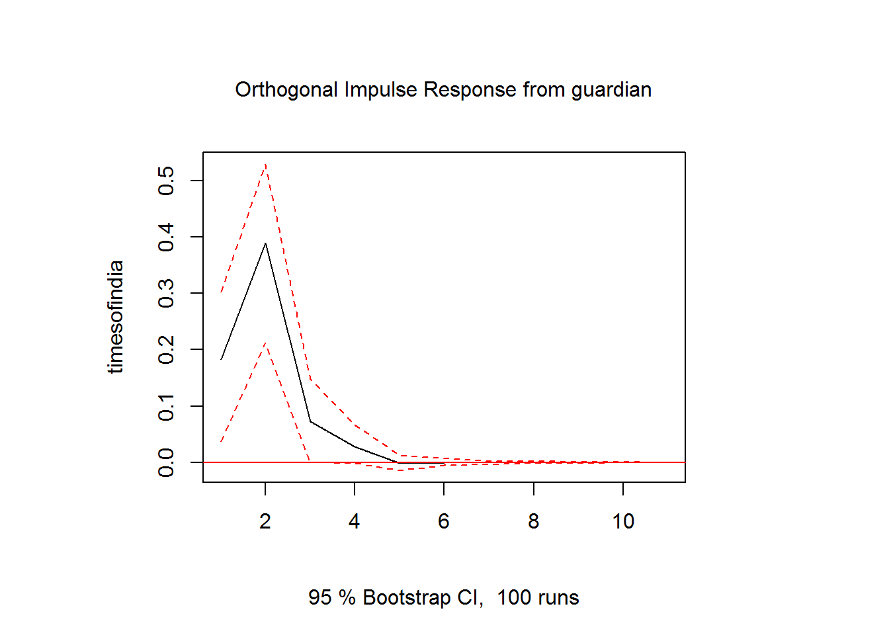
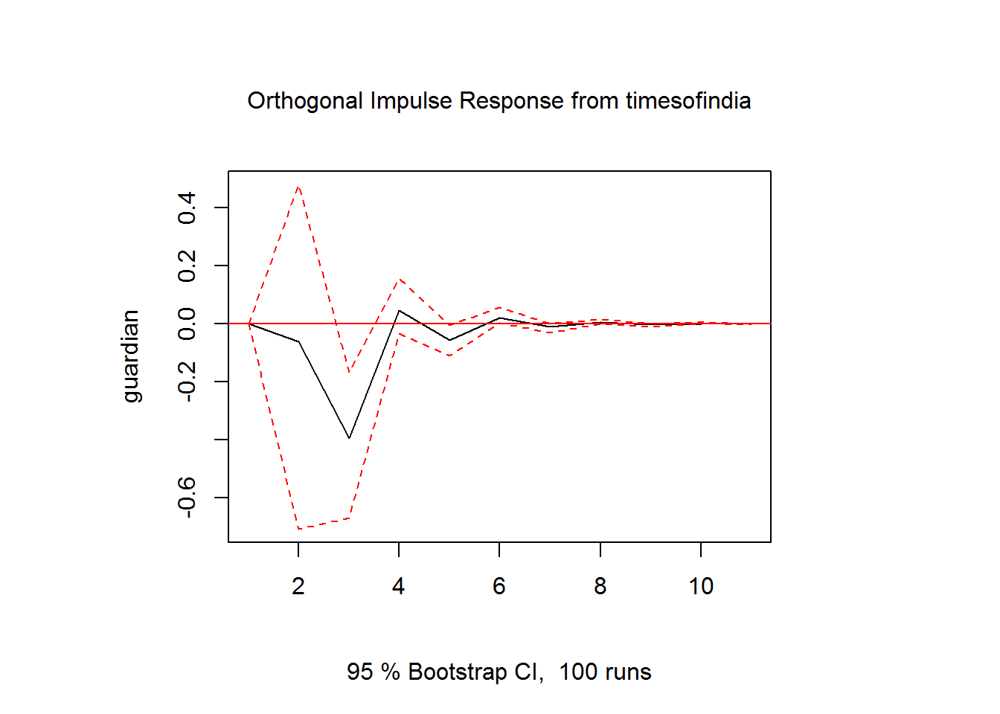
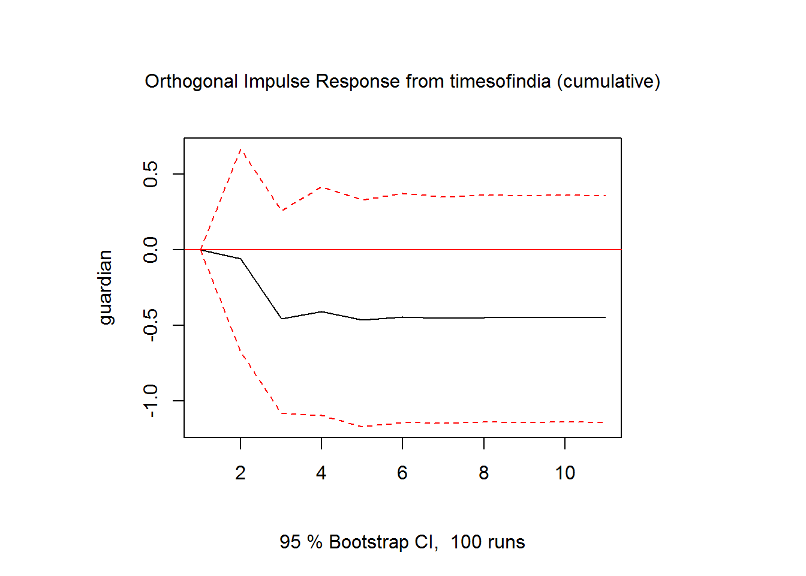

Vector Autoregression with R
================
Josephine Luito
May 20, 2019

Today, we'll be working with some counts of articles about Brexit. For this exercise, we'll be using the simple Date object to handle the time variable. Our focus will be on constructing a Vector autoregression model. To do this, we will use the following packages: `vars` (the primary package), `tsDyn`, `lmtest`, and `fracdiff`, and `xts`. You should also load our core time series packages (`forecast` and `tseries`), as well as `tidyverse`.

Importing data
==============

First, let's import the data.

``` r
brexit_full <- read.csv("brexit_exercise_data.csv", header = TRUE, sep = ",", stringsAsFactors = F) %>% 
  as.data.frame()
nrow(brexit_full)
```

    ## [1] 366

What is the structure of each variable?

``` r
str(brexit_full)
```

    ## 'data.frame':    366 obs. of  7 variables:
    ##  $ date        : chr  "3/12/2018" "3/13/2018" "3/14/2018" "3/15/2018" ...
    ##  $ guardian    : int  16 20 18 16 20 17 13 18 19 23 ...
    ##  $ timesofindia: int  1 2 2 1 2 1 1 2 0 1 ...
    ##  $ german      : int  50 61 64 63 44 29 31 123 95 61 ...
    ##  $ nyt         : int  0 0 2 3 1 6 1 5 4 5 ...
    ##  $ approval    : int  43 43 43 43 43 43 43 43 43 43 ...
    ##  $ event       : int  0 0 0 0 0 0 0 0 0 0 ...

So `date` is treated as a character. Let's turn this into a `Date` class. Then, we'll convert the whole data frame into an xts object. If you recall from our Wrangling section, we ca use a `Date` class as an index for an `xts` object.

``` r
brexit_date <- as.Date(brexit_full$date, format = "%m/%d/%Y")
brexit_full$date <- NULL
brexit_ts <- xts(brexit_full, order.by = brexit_date) #this can also take a frequency number
```

Check out `View(brexit_ts)` to see what the dataframe looks like now (so tidy!)

Univariate Analysis
===================

First, we'll look at the univariate data generating processes using `auto.arima()`. We'll also run the kpss and adf test, though just for the first variables (The Guardian). Run the others yourself to see what they look like!

``` r
auto.arima(brexit_ts$guardian) #3,1,2
```

    ## Series: brexit_ts$guardian 
    ## ARIMA(3,1,2) 
    ## 
    ## Coefficients:
    ##          ar1      ar2      ar3      ma1     ma2
    ##       0.7756  -0.2983  -0.2004  -1.4104  0.5930
    ## s.e.  0.1278   0.0731   0.0674   0.1244  0.1047
    ## 
    ## sigma^2 estimated as 34.06:  log likelihood=-1159.97
    ## AIC=2331.95   AICc=2332.18   BIC=2355.35

``` r
tseries::adf.test(brexit_ts$guardian)
```

    ## 
    ##  Augmented Dickey-Fuller Test
    ## 
    ## data:  brexit_ts$guardian
    ## Dickey-Fuller = -3.7596, Lag order = 7, p-value = 0.02129
    ## alternative hypothesis: stationary

``` r
tseries::kpss.test(brexit_ts$guardian)
```

    ## Warning in tseries::kpss.test(brexit_ts$guardian): p-value smaller than
    ## printed p-value

    ## 
    ##  KPSS Test for Level Stationarity
    ## 
    ## data:  brexit_ts$guardian
    ## KPSS Level = 2.9269, Truncation lag parameter = 5, p-value = 0.01

``` r
auto.arima(brexit_ts$timesofindia) #1,0,2
```

    ## Series: brexit_ts$timesofindia 
    ## ARIMA(1,0,2) with non-zero mean 
    ## 
    ## Coefficients:
    ##          ar1      ma1      ma2    mean
    ##       0.8768  -0.5956  -0.1145  1.7863
    ## s.e.  0.0634   0.0838   0.0593  0.2031
    ## 
    ## sigma^2 estimated as 2.819:  log likelihood=-707.06
    ## AIC=1424.12   AICc=1424.28   BIC=1443.63

``` r
auto.arima(brexit_ts$german) #2,1,1
```

    ## Series: brexit_ts$german 
    ## ARIMA(2,1,1) 
    ## 
    ## Coefficients:
    ##          ar1      ar2      ma1
    ##       0.8709  -0.3376  -0.9571
    ## s.e.  0.0522   0.0515   0.0215
    ## 
    ## sigma^2 estimated as 2578:  log likelihood=-1950.78
    ## AIC=3909.55   AICc=3909.66   BIC=3925.15

``` r
auto.arima(brexit_ts$nyt) #2,1,1
```

    ## Series: brexit_ts$nyt 
    ## ARIMA(2,1,1) 
    ## 
    ## Coefficients:
    ##          ar1      ar2      ma1
    ##       0.5816  -0.0960  -0.9788
    ## s.e.  0.0536   0.0535   0.0113
    ## 
    ## sigma^2 estimated as 5.533:  log likelihood=-829.72
    ## AIC=1667.43   AICc=1667.54   BIC=1683.03

``` r
auto.arima(brexit_ts$approval) #0,1,0
```

    ## Series: brexit_ts$approval 
    ## ARIMA(0,1,0) 
    ## 
    ## sigma^2 estimated as 0.2767:  log likelihood=-283.44
    ## AIC=568.88   AICc=568.89   BIC=572.78

Only Times of India is not integrated (i.e., this is the only stationary time series). We will need to first-difference most of the variables in order to use it in the VAR.

To do so, we'll use the `fracdiff` function. Important to note: this function allows you to fractionally difference. However, for this toy example, let's assume all the series (minus Times of India) are not-stationary; I(1).

``` r
fd_guardian <- fracdiff::diffseries(brexit_ts$guardian, 1)
fd_germany <- fracdiff::diffseries(brexit_ts$german, 1)
fd_nyt <- fracdiff::diffseries(brexit_ts$nyt, 1)
td_timesofindia <- brexit_ts$timesofindia 
fd_approval <- fracdiff::diffseries(brexit_ts$approval, 1) 
```

Now that we've first-differenced all the data, we can proceed with the VAR.

VAR Model
=========

The first decision we will have to make is which variables are endogenous and which are exogenous. Let's assume all the variables are endogenous except events. Though events matter, it is more likely that events would preceed activity (events may be influenced by its own media attention, but we'll set aside that question for now). In order to use both, we will need to construct one data frame with endogenous variables, and one with exogenous variables.

We also want to make sure we remember the order of our variables. This will be important for interpreting the model. We will use the following order: The Guardian, NYT, Times of India, German media, and public approval of the Brexit plan.

``` r
var.endo <- data.frame(guardian = fd_guardian, 
                       timesofindia = td_timesofindia, 
                       nyt = fd_nyt, 
                       germany = fd_germany, 
                       p_approval = fd_approval)
var.exo <- data.frame(event = brexit_ts$event)
```

One of the most important variables you will have to decide upon is the lag. We use information critera to make this decision. Here, we'll show you two example functions, one from `tsDyn` and one from `vars`. The first package includes a Bayesian Information Criterion, while the second one (`vars`) does not. However, both are fine to use.

``` r
tsDyn::lags.select(var.endo)
```

    ## Best AIC:  lag= 7 
    ## Best BIC:  lag= 1 
    ## Best HQ :  lag= 3

``` r
lag <- lags.select(var.endo) #stores this as an object
lag$BICs #allows you to see BIC scores
```

    ##        lag=1    lag=2    lag=3    lag=4    lag=5    lag=6    lag=7
    ## r=0 4649.469 4678.456 4715.158 4795.286 4847.298 4938.168 5019.154
    ##        lag=8    lag=9   lag=10
    ## r=0 5136.443 5221.798 5339.382

``` r
vars::VARselect(var.endo) #automatically reports information criterion
```

    ## $selection
    ## AIC(n)  HQ(n)  SC(n) FPE(n) 
    ##      7      3      1      7 
    ## 
    ## $criteria
    ##                   1            2            3            4            5
    ## AIC(n)     12.73377     12.54308     12.37406     12.32702     12.20100
    ## HQ(n)      12.86366     12.78121     12.72044     12.78164     12.76387
    ## SC(n)      13.06031     13.14173     13.24483     13.46990     13.61601
    ## FPE(n) 339009.30813 280176.36743 236655.08336 225867.36574 199248.00375
    ##                   6            7            8            9           10
    ## AIC(n)     12.18414     12.13951     12.19686     12.16451     12.22268
    ## HQ(n)      12.85525     12.91887     13.08446     13.16035     13.32677
    ## SC(n)      13.87126     14.09875     14.42821     14.66797     14.99826
    ## FPE(n) 196094.44798 187771.25826 199185.97901 193255.87930 205377.39186

For the sale of simplicity, we'll run a VAR(1). However, as you are model-testing for your own projects, you'll want to test different lag lengths to determine the most appropriate model.

Let's now run the VAR model! Here, we will rely on the `vars` package.

``` r
var_results <- vars::VAR(var.endo, p = 1, exogen = var.exo)
summary(var_results)
```

    ## 
    ## VAR Estimation Results:
    ## ========================= 
    ## Endogenous variables: guardian, timesofindia, nyt, germany, p_approval 
    ## Deterministic variables: const 
    ## Sample size: 365 
    ## Log Likelihood: -4844.332 
    ## Roots of the characteristic polynomial:
    ## 0.4153 0.4153 0.2512 0.2512 0.005689
    ## Call:
    ## vars::VAR(y = var.endo, p = 1, exogen = var.exo)
    ## 
    ## 
    ## Estimation results for equation guardian: 
    ## ========================================= 
    ## guardian = guardian.l1 + timesofindia.l1 + nyt.l1 + germany.l1 + p_approval.l1 + const + event 
    ## 
    ##                  Estimate Std. Error t value Pr(>|t|)    
    ## guardian.l1     -0.408493   0.055286  -7.389 1.05e-12 ***
    ## timesofindia.l1 -0.166249   0.197438  -0.842   0.4003    
    ## nyt.l1          -0.376421   0.154696  -2.433   0.0155 *  
    ## germany.l1       0.040324   0.007864   5.128 4.81e-07 ***
    ## p_approval.l1   -1.231571   0.656295  -1.877   0.0614 .  
    ## const            0.277465   0.494044   0.562   0.5747    
    ## event            1.492822   2.413896   0.618   0.5367    
    ## ---
    ## Signif. codes:  0 '***' 0.001 '**' 0.01 '*' 0.05 '.' 0.1 ' ' 1
    ## 
    ## 
    ## Residual standard error: 6.603 on 358 degrees of freedom
    ## Multiple R-Squared: 0.1619,  Adjusted R-squared: 0.1479 
    ## F-statistic: 11.53 on 6 and 358 DF,  p-value: 8.397e-12 
    ## 
    ## 
    ## Estimation results for equation timesofindia: 
    ## ============================================= 
    ## timesofindia = guardian.l1 + timesofindia.l1 + nyt.l1 + germany.l1 + p_approval.l1 + const + event 
    ## 
    ##                 Estimate Std. Error t value Pr(>|t|)    
    ## guardian.l1     0.037198   0.013442   2.767  0.00595 ** 
    ## timesofindia.l1 0.299919   0.048004   6.248 1.18e-09 ***
    ## nyt.l1          0.047944   0.037611   1.275  0.20323    
    ## germany.l1      0.001962   0.001912   1.026  0.30552    
    ## p_approval.l1   0.058372   0.159566   0.366  0.71472    
    ## const           1.188717   0.120118   9.896  < 2e-16 ***
    ## event           2.691544   0.586894   4.586 6.25e-06 ***
    ## ---
    ## Signif. codes:  0 '***' 0.001 '**' 0.01 '*' 0.05 '.' 0.1 ' ' 1
    ## 
    ## 
    ## Residual standard error: 1.606 on 358 degrees of freedom
    ## Multiple R-Squared: 0.216,   Adjusted R-squared: 0.2028 
    ## F-statistic: 16.44 on 6 and 358 DF,  p-value: < 2.2e-16 
    ## 
    ## 
    ## Estimation results for equation nyt: 
    ## ==================================== 
    ## nyt = guardian.l1 + timesofindia.l1 + nyt.l1 + germany.l1 + p_approval.l1 + const + event 
    ## 
    ##                  Estimate Std. Error t value Pr(>|t|)    
    ## guardian.l1      0.035058   0.019467   1.801   0.0726 .  
    ## timesofindia.l1 -0.161839   0.069521  -2.328   0.0205 *  
    ## nyt.l1          -0.409149   0.054471  -7.511 4.71e-13 ***
    ## germany.l1       0.019520   0.002769   7.050 9.29e-12 ***
    ## p_approval.l1   -0.140492   0.231091  -0.608   0.5436    
    ## const            0.240712   0.173960   1.384   0.1673    
    ## event            3.373607   0.849966   3.969 8.72e-05 ***
    ## ---
    ## Signif. codes:  0 '***' 0.001 '**' 0.01 '*' 0.05 '.' 0.1 ' ' 1
    ## 
    ## 
    ## Residual standard error: 2.325 on 358 degrees of freedom
    ## Multiple R-Squared: 0.2462,  Adjusted R-squared: 0.2336 
    ## F-statistic: 19.49 on 6 and 358 DF,  p-value: < 2.2e-16 
    ## 
    ## 
    ## Estimation results for equation germany: 
    ## ======================================== 
    ## germany = guardian.l1 + timesofindia.l1 + nyt.l1 + germany.l1 + p_approval.l1 + const + event 
    ## 
    ##                  Estimate Std. Error t value Pr(>|t|)    
    ## guardian.l1       0.32152    0.44998   0.715   0.4754    
    ## timesofindia.l1  -6.54810    1.60700  -4.075 5.68e-05 ***
    ## nyt.l1           -0.99835    1.25911  -0.793   0.4284    
    ## germany.l1        0.09068    0.06401   1.417   0.1574    
    ## p_approval.l1   -12.52832    5.34174  -2.345   0.0196 *  
    ## const             9.80471    4.02114   2.438   0.0152 *  
    ## event           114.74263   19.64726   5.840 1.17e-08 ***
    ## ---
    ## Signif. codes:  0 '***' 0.001 '**' 0.01 '*' 0.05 '.' 0.1 ' ' 1
    ## 
    ## 
    ## Residual standard error: 53.75 on 358 degrees of freedom
    ## Multiple R-Squared: 0.1472,  Adjusted R-squared: 0.1329 
    ## F-statistic:  10.3 on 6 and 358 DF,  p-value: 1.571e-10 
    ## 
    ## 
    ## Estimation results for equation p_approval: 
    ## =========================================== 
    ## p_approval = guardian.l1 + timesofindia.l1 + nyt.l1 + germany.l1 + p_approval.l1 + const + event 
    ## 
    ##                   Estimate Std. Error t value Pr(>|t|)
    ## guardian.l1     -0.0017842  0.0044336  -0.402    0.688
    ## timesofindia.l1  0.0021872  0.0158333   0.138    0.890
    ## nyt.l1           0.0134390  0.0124056   1.083    0.279
    ## germany.l1      -0.0006436  0.0006306  -1.021    0.308
    ## p_approval.l1    0.0074096  0.0526307   0.141    0.888
    ## const           -0.0126357  0.0396192  -0.319    0.750
    ## event            0.0320186  0.1935790   0.165    0.869
    ## 
    ## 
    ## Residual standard error: 0.5296 on 358 degrees of freedom
    ## Multiple R-Squared: 0.005761,    Adjusted R-squared: -0.0109 
    ## F-statistic: 0.3457 on 6 and 358 DF,  p-value: 0.9122 
    ## 
    ## 
    ## 
    ## Covariance matrix of residuals:
    ##               guardian timesofindia     nyt   germany p_approval
    ## guardian      43.60573      1.20381  4.6383  183.7616    0.03001
    ## timesofindia   1.20381      2.57766  0.4647   17.0413    0.02511
    ## nyt            4.63833      0.46470  5.4064   62.1490   -0.11556
    ## germany      183.76156     17.04131 62.1490 2888.7552    0.31142
    ## p_approval     0.03001      0.02511 -0.1156    0.3114    0.28043
    ## 
    ## Correlation matrix of residuals:
    ##              guardian timesofindia      nyt germany p_approval
    ## guardian     1.000000      0.11355  0.30209 0.51776   0.008583
    ## timesofindia 0.113546      1.00000  0.12448 0.19749   0.029533
    ## nyt          0.302089      0.12448  1.00000 0.49731  -0.093852
    ## germany      0.517759      0.19749  0.49731 1.00000   0.010942
    ## p_approval   0.008583      0.02953 -0.09385 0.01094   1.000000

Wow! Tons of results. We can explore some of these significant relationships using Granger causality tests and IRFs.

Granger causality
=================

Wikipedia: <a href="https://en.wikipedia.org/wiki/Granger_causality" class="uri" target="_blank">https://en.wikipedia.org/wiki/Granger_causality</a> 
Below are examples of of two Granger causality tests. The bivariate (two-way) test can be found in the `lmtest` package (`grangertest()`), and the cumulative Granger test in the `vars` package (`causality()`).

For the `grangertest()` function, your DV will be on the left, and your IV will be on the right. This test will compare whether a model predicting your IV is better with the inclusion of lagged variables of your DV (or whether the lagged variables of your IV do enough).

`grangertest()` in `lmtest` package: <a href="https://rdrr.io/cran/lmtest/man/grangertest.html" class="uri" target="_blank">https://rdrr.io/cran/lmtest/man/grangertest.html</a>

`causality()` in `vars` package: <a href="https://www.rdocumentation.org/packages/vars/versions/1.5-3/topics/causality" class="uri" target="_blank">https://www.rdocumentation.org/packages/vars/versions/1.5-3/topics/causality</a>

``` r
lmtest::grangertest(var.endo$guardian ~ var.endo$timesofindia, order = 1)
```

    ## Granger causality test
    ## 
    ## Model 1: var.endo$guardian ~ Lags(var.endo$guardian, 1:1) + Lags(var.endo$timesofindia, 1:1)
    ## Model 2: var.endo$guardian ~ Lags(var.endo$guardian, 1:1)
    ##   Res.Df Df      F Pr(>F)
    ## 1    362                 
    ## 2    363 -1 0.0577 0.8102

``` r
vars::causality(var_results, cause = "guardian")
```

    ## $Granger
    ## 
    ##  Granger causality H0: guardian do not Granger-cause timesofindia
    ##  nyt germany p_approval
    ## 
    ## data:  VAR object var_results
    ## F-Test = 2.5725, df1 = 4, df2 = 1790, p-value = 0.03617
    ## 
    ## 
    ## $Instant
    ## 
    ##  H0: No instantaneous causality between: guardian and timesofindia
    ##  nyt germany p_approval
    ## 
    ## data:  VAR object var_results
    ## Chi-squared = 77.8, df = 4, p-value = 5.551e-16

``` r
vars::causality(var_results, cause = "guardian")
```

    ## $Granger
    ## 
    ##  Granger causality H0: guardian do not Granger-cause timesofindia
    ##  nyt germany p_approval
    ## 
    ## data:  VAR object var_results
    ## F-Test = 2.5725, df1 = 4, df2 = 1790, p-value = 0.03617
    ## 
    ## 
    ## $Instant
    ## 
    ##  H0: No instantaneous causality between: guardian and timesofindia
    ##  nyt germany p_approval
    ## 
    ## data:  VAR object var_results
    ## Chi-squared = 77.8, df = 4, p-value = 5.551e-16

``` r
#grangertest(var.endo$timesindia ~ var.endo$guardian, order = 1)
#grangertest(var.endo$guardian ~ var.endo$germany, order = 1)
#grangertest(var.endo$guardian ~ var.endo$nyt, order = 1)
```

YOUR TURN!
----------

<span style="color:red">Take one of the other statistically significant relationships and run a granger causality test (focus on the two-way). What do you find? Is the relationship statistically significant?</span>

IRFs
====

Finally, we turn to impulse response functions (IRFs), which can be found in the `vars` package (the function is just `irf()`).

The `irf()` function has a lot of important attributes that need to be included. Here are the primary ones: the results of the var (`var_results`), the IV you want to shock (`guardian`), the DV that is responsing (`timesofindia`), and the `n.ahead`, or the number of time points you want to expand to (if you write 6, it will look from time 1\[t\] to 7\[t-6\]).

There are two other attributes that affect the results -- orthogonal or cumulative. The `cumulative` attribute has a long run multiplier effect. What you're really looking for in this figure is the point in which the IRF line stabilizes.

The non-cumulative results will not assume a long run effect, and so the effect of the shock is taken independently for each time point. If viewing these results, you want to look for the point in which the confidence intervals cross or touch zero (`0.0`).

Orthogonal shocks are a little tricker to explain, but just know that they are important to IRFs. If you'd like to do some more in-depth math reading, I encourage you to visit the following pages: [Link 1](https://blog.stata.com/2016/09/20/structural-vector-autoregression-models/) and [Link 2](https://www.mathworks.com/help/econ/compare-generalized-and-orthogonalized-impulse-response-functions.html)

``` r
vars::irf(var_results, impulse = "guardian", response = "timesofindia", n.ahead = 10, cumulative = T, ortho = T) %>% 
  plot()
```



``` r
vars::irf(var_results, impulse = "guardian", response = "timesofindia", n.ahead = 10, cumulative = F, ortho = T) %>% 
  plot()
```



If we look at these two IRFs, we can tell that a shock at t lasts for two time periods (`t+1` and `t+2`). It may still matter at `t+3`, but the shock's relevance to the DV is drastically dimished. By `t+4`, the series has basically leveled off.

Now, the order of the VAR is important because it influences the interpretation of the IRF. Recall that this is our order: The Guardian, Times of India, New York Times, German media, and Public Approval. In the above example, we look at The Guardian's shock on Times of India. This shock occurs at t, because The Guardian is listed before Times of India.

In the example below, you'll see an IRF for the reverse relatioship (what does a shock of `timesofindia` do to `guardian`?). Because Times of India is listed as AFTER The Guardian, Times of India cannot shock The Guardian at `t`. Rather, the shock would occur at `t+1`. We can see this in the figure, because time `t` is zero.

``` r
vars::irf(var_results, impulse = "timesofindia", response = "guardian", n.ahead = 10, cumulative = F, ortho = T) %>% 
  plot()
```



``` r
vars::irf(var_results, impulse = "timesofindia", response = "guardian", n.ahead = 10, cumulative = T, ortho = T) %>% 
  plot()
```



Note here a possibly interesting dyamic at time `t+3`. We can't really tease this out further (our VAR only has a lag of 1). However, this does signal to us that we may want to look at more lags in the model, so as to capture later dynamics. Recall that our earlier analysis of the "optimal lag" was mixed--the BIC selected a lag of 1 as the best, but the other Information Criteria recommended larger lag lengths.

YOUR TURN!
----------

<span style="color:red">Take one of the other statistically significant Granger causal relationships and run a four Granger causality tests (you should look at both directions of the relationship, even if one is not statistically significant--you can use this to show that a relationship is unidirectional or bidirectional). Two of your tests should be cumulative, two should not be.</span>

<span style="color:red">What do you find? Is your relationship uni-directional or bi-directional?</span>

Post-Hoc Tests
==============

A common post-hoc test for autocorrelation is the Durbin-Watson. You do *not* want autocorrelation in your residuals (this should have been removed from the VAR)

``` r
dwtest(var_results$varresult$guardian, exact = FALSE) #set exact to TRUE if you have fewer than 100
```

    ## 
    ##  Durbin-Watson test
    ## 
    ## data:  var_results$varresult$guardian
    ## DW = 2.1385, p-value = 0.7612
    ## alternative hypothesis: true autocorrelation is greater than 0

``` r
dwtest(var_results$varresult$timesofindia, exact = FALSE)
```

    ## 
    ##  Durbin-Watson test
    ## 
    ## data:  var_results$varresult$timesofindia
    ## DW = 2.1303, p-value = 0.7612
    ## alternative hypothesis: true autocorrelation is greater than 0

``` r
dwtest(var_results$varresult$nyt, exact = FALSE)
```

    ## 
    ##  Durbin-Watson test
    ## 
    ## data:  var_results$varresult$nyt
    ## DW = 2.163, p-value = 0.7612
    ## alternative hypothesis: true autocorrelation is greater than 0

``` r
dwtest(var_results$varresult$germany, exact = FALSE)
```

    ## 
    ##  Durbin-Watson test
    ## 
    ## data:  var_results$varresult$germany
    ## DW = 1.9838, p-value = 0.7612
    ## alternative hypothesis: true autocorrelation is greater than 0

``` r
dwtest(var_results$varresult$p_approval, exact = FALSE)
```

    ## 
    ##  Durbin-Watson test
    ## 
    ## data:  var_results$varresult$p_approval
    ## DW = 1.997, p-value = 0.7612
    ## alternative hypothesis: true autocorrelation is greater than 0

Another test you might see is Ljung-Box test, which tests the residuals for statistical independence between a value at `t` and a value at `t+1`. In other words: are your residuals white noise?

``` r
residualy <- residuals(var_results)
colnames(residualy)
```

    ## [1] "guardian"     "timesofindia" "nyt"          "germany"     
    ## [5] "p_approval"

``` r
Box.test(residualy[,1], type='Ljung',lag=1) # retweets
```

    ## 
    ##  Box-Ljung test
    ## 
    ## data:  residualy[, 1]
    ## X-squared = 1.8233, df = 1, p-value = 0.1769

``` r
Box.test(residualy[,2], type='Ljung',lag=1) # retweets
```

    ## 
    ##  Box-Ljung test
    ## 
    ## data:  residualy[, 2]
    ## X-squared = 1.5996, df = 1, p-value = 0.206

``` r
Box.test(residualy[,3], type='Ljung',lag=1) # retweets
```

    ## 
    ##  Box-Ljung test
    ## 
    ## data:  residualy[, 3]
    ## X-squared = 2.5632, df = 1, p-value = 0.1094

``` r
Box.test(residualy[,4], type='Ljung',lag=1) # retweets
```

    ## 
    ##  Box-Ljung test
    ## 
    ## data:  residualy[, 4]
    ## X-squared = 0.015292, df = 1, p-value = 0.9016

``` r
Box.test(residualy[,5], type='Ljung',lag=1) # retweets
```

    ## 
    ##  Box-Ljung test
    ## 
    ## data:  residualy[, 5]
    ## X-squared = 0.00081537, df = 1, p-value = 0.9772
